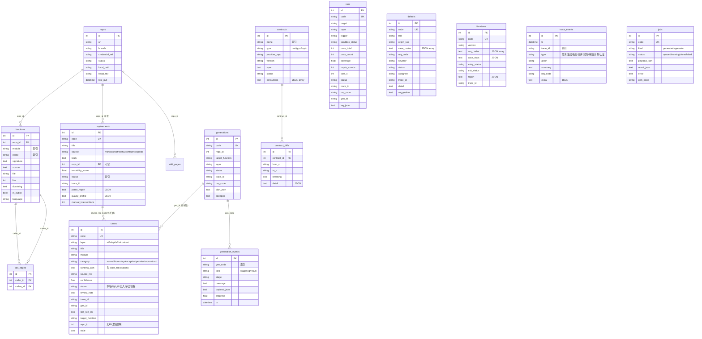
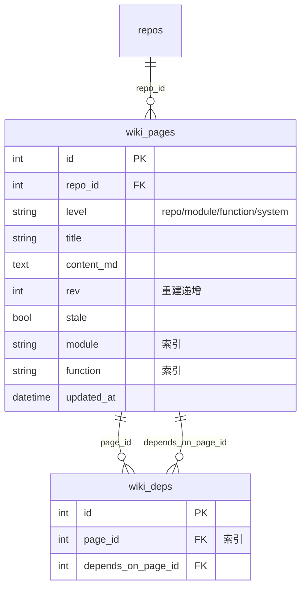
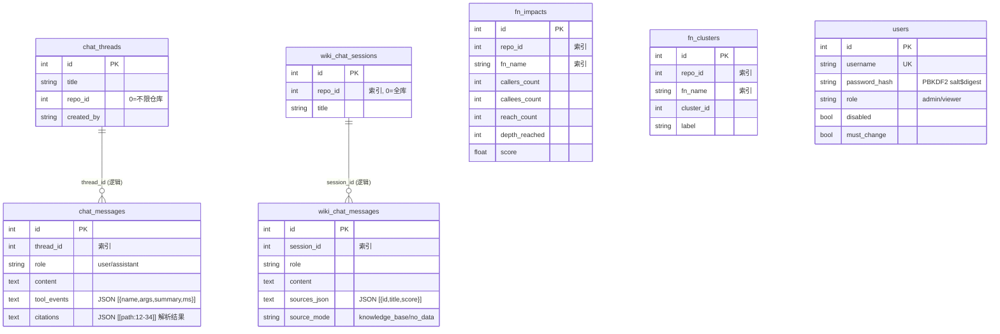

# TestForge 数据库设计（As-Built · 2026-10-10）

> 配套：[PRD v4.0](./TestForge-PRD-v4.0.md) · [架构设计](./TestForge-架构设计.md) · [接口设计](./TestForge-接口设计.md)。
> 数据来源：`backend/services/shared/models.py`（31 张 ORM 表）+ `rag.py`（2 张原生 SQL 表），共 **33 张表**。数据库 PostgreSQL 16 + pgvector。
> 2026-10-10 复核：前端信息架构收敛（Hub 化）纯前端变更，表结构与迁移逻辑零变化，本文内容仍然有效。

---

## 1. 存储总览

| 项 | 值 |
|---|---|
| 数据库 | PostgreSQL 16 + pgvector 扩展（`CREATE EXTENSION IF NOT EXISTS vector`） |
| 连接 | `postgresql+psycopg://…`（SQLAlchemy 2，`pool_pre_ping`，pool_size=5） |
| 建表 | `init_db()` 幂等：`pg_advisory_lock(728401)` 防 7 服务并发 DDL → `Base.metadata.create_all` → 轻量列迁移 → bootstrap_admin → 建向量表 |
| 时间戳约定 | ORM 表默认 `datetime.now()`（本地时间无时区）；`rag_documents` 原生表用 `TIMESTAMPTZ` |
| JSON 约定 | 大量 JSON 以 TEXT 列存储（parse_report / quality_profile / schema_json / log_json / members / result_json…） |
| 级联 | **无 DB 级 ON DELETE 级联**，删除顺序由应用层控制（如删 wiki_pages 前必须先删 wiki_deps 双向边） |

**33 张表分组**：核心业务 14 · Wiki 2 · 质量分析 2 · AI 会话 4 · 知识图谱 KG 6 · RAG/向量 4 · 系统账号 1。

## 2. ER 图（按域）

### 2.1 核心业务域

> 其余核心关联：`defects` 四向弱关联（origin_run→runs.code、case_codes→cases.code、req_code→requirements.code、trace_id）；`trace_events` 按 trace_id 串联八类事件。

### 2.2 Wiki 域

### 2.3 知识图谱 KG 域 + RAG/向量域

```mermaid
erDiagram
    kg_extractions }o--|| rag_documents : "doc_key"
    doc_status }o--o| rag_documents : "doc_key (逻辑)"
    kg_relations }o--o| kg_entities : "src_name/dst_name (逻辑)"

    kg_entities {
        int id PK
        int repo_id "索引"
        string workspace "索引, 空=legacy"
        string name "索引"
        string etype "module/function/concept/defect_pattern…"
        text etype_votes "JSON 类型投票"
        text description
        text desc_sources "JSON {source_ref:desc}"
        text source_refs "JSON array, 选择性删除依据"
        string content_hash
    }
    kg_relations {
        int id PK
        int repo_id "索引"
        string workspace "索引"
        string src_name "索引"
        string dst_name "索引"
        string rtype "默认 related"
        text description
        text desc_sources "JSON"
        float weight "证据计数"
        text source_refs "JSON array"
    }
    kg_extractions {
        int id PK
        int repo_id "索引"
        string workspace "索引"
        string source_ref "kgdoc:xx/wiki:1/defect:BUG-x"
        string doc_key "关联 rag_documents"
        string content_hash
        text result_json "抽取结果留存=删除重建依据"
        int chunk_count
        int gleaning_rounds
    }
    kg_communities {
        int id PK
        int repo_id "索引"
        string workspace "索引"
        int level "1=基础 2=map-reduce"
        int cluster_id
        string title
        text summary
        text members "JSON array"
        int member_count
        string summary_source "llm/concat"
    }
    doc_status {
        int id PK
        int repo_id "索引"
        string workspace "索引"
        string kind "index/wiki/kg/fts/rag/kg_doc"
        string doc_key
        string status "pending/processing/ok/failed/stale"
        text error
        text detail "JSON 进度"
        string content_hash
    }
    kg_settings {
        string key PK
        text value "JSON 标量"
    }
    rag_documents {
        string doc_key PK
        string kind "wiki/user_doc/lesson/plan/req/case/defect/function/contract/kg_chunk/kg_entity/kg_relation/kg_community"
        int repo_id
        string workspace
        string title
        text content
        tsvector fts "GIN 索引"
        vector embedding "维度可迁移"
        jsonb meta
        timestamptz updated_at
    }
    cases_embedding {
        string case_code PK
        vector embedding "固定 256 维"
    }
    llm_cache {
        string cache_key PK "sha256(role|model|system|prompt)"
        string role "extract/query/keyword"
        string model
        text prompt "截断留存审计"
        text response
    }
    embedding_cache {
        string cache_key PK "sha256(backend|model|text)"
        string model
        text vec "JSON array[float]"
    }
```

### 2.4 AI 会话域 + 质量分析域 + 系统域

## 3. 表设计详述

### 3.1 核心业务（14 表）

**repos** — 已接入仓库
| 字段 | 类型 | 默认 | 说明 |
|---|---|---|---|
| id | Integer PK | 自增 | |
| url | String(512) | — | git 地址或 `upload://{slug}`（zip 建仓） |
| branch | String(128) | "main" | |
| credential_ref | String(256) | "" | 凭据引用，不落明文 |
| status | String(32) | "已接入" | |
| local_path | String(512) | "" | 检出目录 |
| head_rev | String(64) | "" | 最近拉取 revision |
| last_pull / created_at | DateTime | NULL / now | |

**functions** — 函数/符号索引：`repo_id`(FK, idx)、`module`(idx)、`name`(idx)、signature/source/docstring(Text)、file、line、is_public(True)、`language`(迁移补列，支持 15 语言)。

**call_edges** — 调用图：`caller_id`、`callee_id` 双 FK→functions.id，双索引。

**requirements** — 需求：`code`(UNIQUE, REQ-n)、`source`(md|docx|pdf|feishu|confluence|paste)、`testability_score`(G0 门禁)、`status`(idx，解析中→待确认→已生效/已打回)、`parse_report`/`quality_profile`(JSON Text)、`manual_interventions`。

**cases** — 测试用例：`code`(UNIQUE)、`layer`(idx：ut|fn|api|e2e|contract)、`category`(idx：normal|boundary|exception|permission|contract)、`schema_json`(含 code_file、citations 快照)、`status`(idx：草稿|待人审|已入库|已替换)、`stale`(回归标记)、`confidence`、`target_function`、`repo_id`（**无 FK**，逻辑关联）。

**runs** — 执行记录：`code`(UNIQUE, RUN-x)、sandbox_status、pass_total/pass_count、coverage、repair_rounds、cost_s、`log_json`(时间线)、trace_id/req_code/gen_id 弱关联。保留策略：平台只留最近 500 条（应用层 prune）。

**defects** — 缺陷：`code`(UNIQUE, BUG-x)、case_codes(JSON 数组)、severity(按失败数定级)、status(新建→已确认→修复中→待回归→已关闭)、`suggestion`(AI 建议，迁移补列)。

**iterations** — 迭代：`code`(UNIQUE, ITER-x)、req_codes(JSON)、case_stats(JSON)、entry_status/exit_status、report(JSON)。

**trace_events** — 追溯事件：ts(idx)、trace_id(idx)、type(需求|生成|执行|仓库|契约|缺陷|计划|认证)、summary、req_code(idx)、extra(JSON)；复合索引 `ix_trace_events_trace (trace_id, ts)`；入库前 sanitize 脱敏。

**generations / generation_events** — 生成任务与事件流：gen 唯一 code(GEN-x) + plan_json + codegen(最终 pytest)；events 按 gen_code(idx) 记 kind(stage|log|result)/stage/message/payload_json/progress，支撑 SSE 回放。

**jobs** — 持久化队列：code(JOB-x, UNIQUE)、kind(generate|regression, idx)、status(queued|running|done|failed, idx)、payload_json/result_json/error、gen_code；worker `FOR UPDATE SKIP LOCKED` 取单，崩溃后 running 重排队。

**contracts / contract_diffs** — 契约与版本 diff：type(rest|grpc|topic)、spec(Text)、consumers(JSON)、version；diffs 记 from_v/to_v/breaking/detail(JSON)。

### 3.2 Wiki（2 表）

**wiki_pages**：repo_id(FK, idx)、level(idx：repo|module|function|system)、title、content_md、`rev`(重建递增)、stale、module/function(idx)。
**wiki_deps**：page_id(FK, idx)、depends_on_page_id(FK) 双向边。

### 3.3 质量分析（2 表）

**fn_impacts** — 索引期预计算影响面：callers/callees/reach_count、depth_reached、score；**唯一索引** `ix_fn_impact_repo_fn (repo_id, fn_name)`。
**fn_clusters** — Louvain 测试域聚类：cluster_id、label；**唯一索引** `ix_fn_cluster_repo_fn (repo_id, fn_name)`。

### 3.4 AI 会话（4 表）

**chat_threads / chat_messages** — AI 助手：thread(title/repo_id/created_by)；message(role/content/`tool_events` JSON/`citations` JSON)。thread_id 仅逻辑关联（无 DB FK）。
**wiki_chat_sessions / wiki_chat_messages** — Wiki 问答：session(repo_id=0 全库)；message(`sources_json`、`source_mode`=knowledge_base|no_data 反幻觉口径)。

### 3.5 知识图谱 KG（6 表）

**kg_entities** — 文档级实体：repo_id/workspace 双 idx；name(idx)；etype（投票制：`etype_votes` JSON 多数胜出）；`desc_sources`（{source_ref: desc}，<8 拼接 ≥8 LLM 摘要）；`source_refs`（选择性删除依据）；content_hash。
**kg_relations** — 关系边：src_name/dst_name(idx) 逻辑指向 kg_entities.name；weight=证据计数；source_refs。
**kg_extractions** — 每份源文档抽取结果留存（删除重建的数据源）：source_ref(idx：kgdoc:xx/wiki:1/defect:BUG-x)、doc_key、result_json、chunk_count、gleaning_rounds；复合索引 `(repo_id, workspace, source_ref)`。
**kg_communities** — 社区与报告：level(1 基础/2 reduce)、cluster_id、members(JSON)、summary、summary_source(llm|concat)；复合索引 `(repo_id, workspace, level, cluster_id)`。
**doc_status** — 摄入状态机：kind(idx：index|wiki|kg|fts|rag|kg_doc)、status(idx：pending|processing|ok|failed|stale)、error、detail(JSON 进度)；**唯一索引** `(repo_id, kind, doc_key)`。
**kg_settings** — 运行时参数覆盖：key(PK)/value(JSON 标量)，优先于 .env 默认值。

> **唯一键升级注意**：kg_entities 模型声明 `(repo_id, name)` UNIQUE，但 init_db 会 DROP 它并改建 **`(repo_id, workspace, name)` UNIQUE**——实际生效的是后者（workspace 隔离的关键）。

### 3.6 RAG / 向量（4 表）

**rag_documents**（原生 SQL，rag.py）— 统一混合检索表：
| 字段 | 类型 | 说明 |
|---|---|---|
| doc_key | TEXT PK | 业务键或 `kgc:{主文档}:{index}`（chunk 行） |
| kind | TEXT | wiki/user_doc/lesson/plan/req/case/defect/function/contract/kg_chunk/kg_entity/kg_relation/kg_community |
| repo_id / workspace | INTEGER / TEXT | 作用域隔离 |
| title / content | TEXT | |
| **fts** | tsvector | `to_tsvector('simple', tokens)`，GIN 索引 |
| **embedding** | vector(dim) | 可 NULL；维度随 embedding 后端自动迁移 |
| meta | JSONB | parent/index/strategy/tokens 等 |
| updated_at | TIMESTAMPTZ | |

索引：kind / repo_id / workspace 三个 B-tree + `GIN(fts)`；**无向量 ANN 索引**（当前规模用 `embedding <-> :e` 精确扫描，RRF k=60 与 ts_rank 融合）。

**cases_embedding**（原生 SQL）— 旧路径兼容：case_code PK + `vector(256)` 固定维度；新用例已改走 rag_documents，此表仅兜底余弦检索。

**llm_cache** — LLM 抽取缓存：cache_key PK = sha256(role|model|system|prompt)、role(extract|query|keyword)、prompt 截断留存审计。
**embedding_cache** — 神经 embedding 持久缓存：cache_key PK = sha256(backend|model|text)、vec(JSON 数组，非 pgvector 列)。

### 3.7 系统账号（1 表）

**users**：username(UNIQUE)、password_hash(PBKDF2 `salt$digest`)、role(admin|viewer)、disabled、must_change；init_db 空表时 bootstrap_admin 引导。

## 4. 迁移机制

| 机制 | 内容 |
|---|---|
| 并发防护 | `pg_advisory_lock(728401)` 包住建表 + 迁移（7 个服务共享 init_db） |
| 轻量列迁移 | `ALTER TABLE … ADD COLUMN IF NOT EXISTS`：functions.language、cases.stale、defects.suggestion、users.disabled/must_change、kg_entities.workspace/etype_votes/desc_sources、kg_relations.workspace/source_refs/desc_sources、doc_status.workspace/content_hash |
| 唯一键升级 | DROP `ix_kg_entity_repo_name` → CREATE UNIQUE `ix_kg_entity_repo_ws_name (repo_id, workspace, name)` |
| 向量维度迁移 | 查 `pg_attribute.atttypmod` 得当前维度 ≠ `embedding.dim()` 时 `ALTER COLUMN embedding TYPE vector({dim})` 并 `UPDATE … SET embedding=NULL`（需跑 `make kg-rebuild-vdb` 重嵌全库） |
| 维度来源 | local 后端恒 256（默认零依赖）；openai 后端按模型：bge-m3 / text-embedding-3-large=1024、text-embedding-3-small=1536、其余首调后学习 |
| 已知债 | 无 Alembic 版本化迁移（路线图 P2）；cases_embedding 不做维度迁移（固定 256） |

## 5. 设计决策

1. **弱关联为主**：全库仅 8 个 DB 级 FK（functions/wiki_deps/requirements/contract_diffs），业务链（cases↔runs↔defects↔requirements）一律 code 字符串弱关联——跨服务写入无需顺序约束，删除由应用层管序（教训已固化：删 wiki_pages 前必须先清 wiki_deps 双向边）。
2. **JSON TEXT 列**：schema/报告/配置类结构演进快，TEXT+JSON 换取零迁移成本；仅 rag_documents 用原生 JSONB（需要 meta 查询）。
3. **一表多 kind**：rag_documents 单表承载 13 种检索对象——RRF 融合天然跨 kind，workspace 列做多仓库/多工作区隔离。
4. **KG 三段式**：抽取留存（kg_extractions）与合并态（kg_entities/kg_relations）分离——删文档从剩余抽取重建图谱而不重跑 LLM，是可观测可恢复的关键。
5. **缓存即表**：llm_cache / embedding_cache 落库而非内存——增量重建、重复查询、崩溃恢复全部零重复成本。
6. **保留策略**：runs 应用层保留 500 条；用例「已替换」而非物理删除（审计与回溯优先）。
