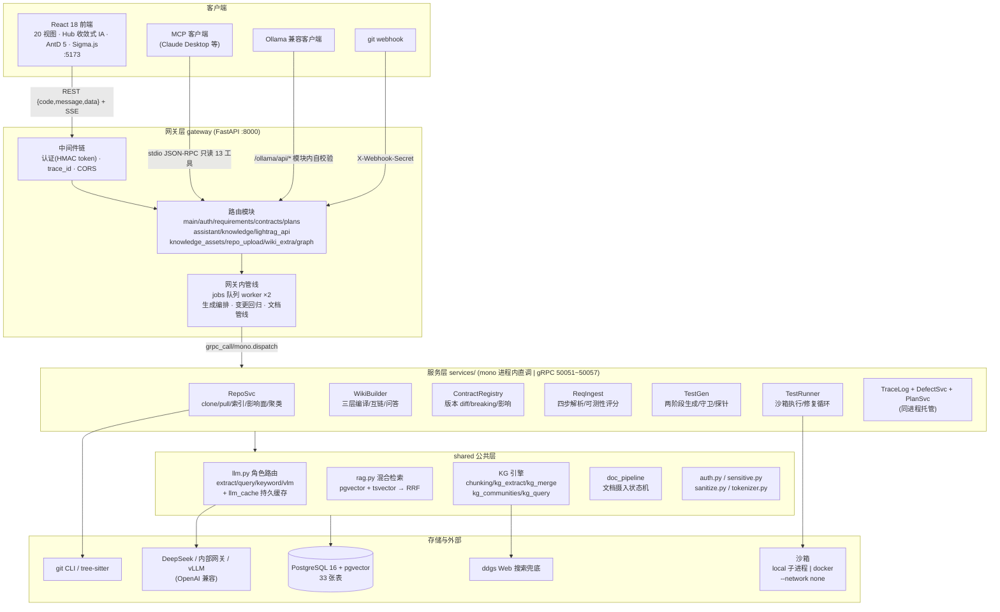
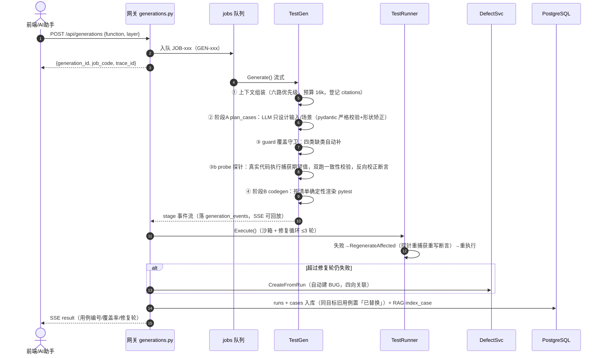
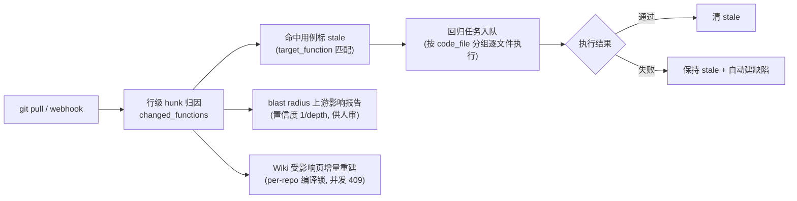
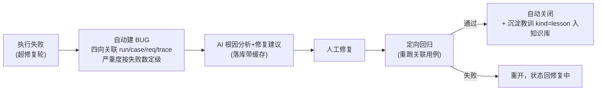
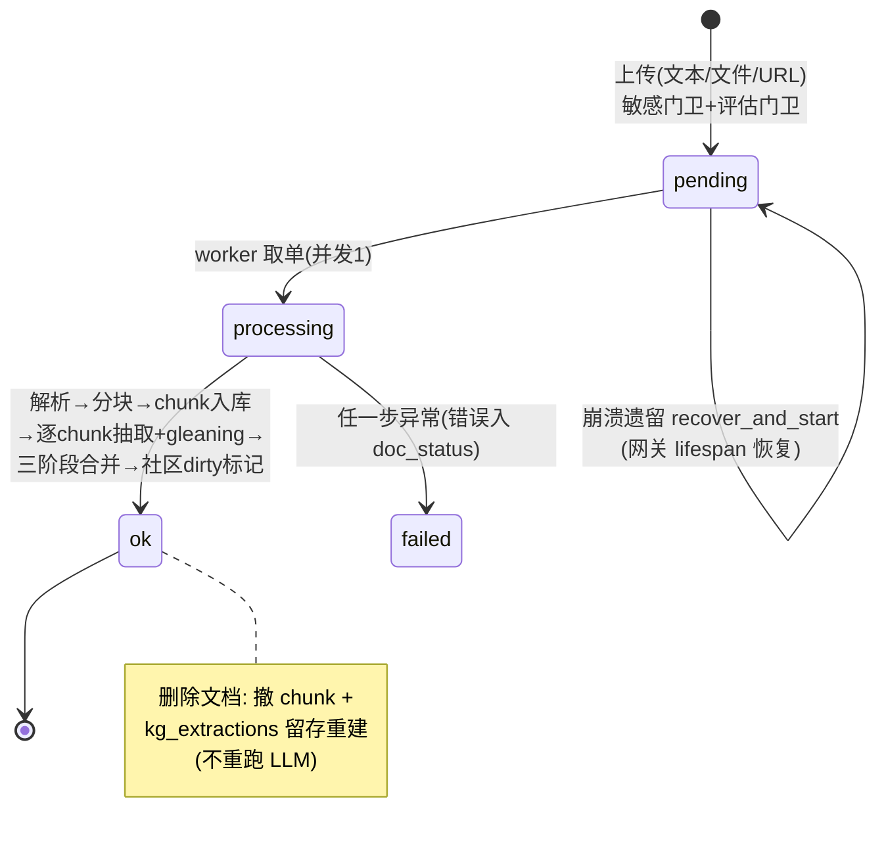
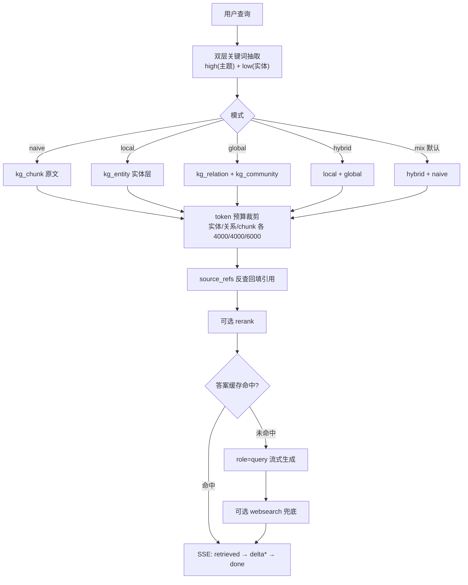
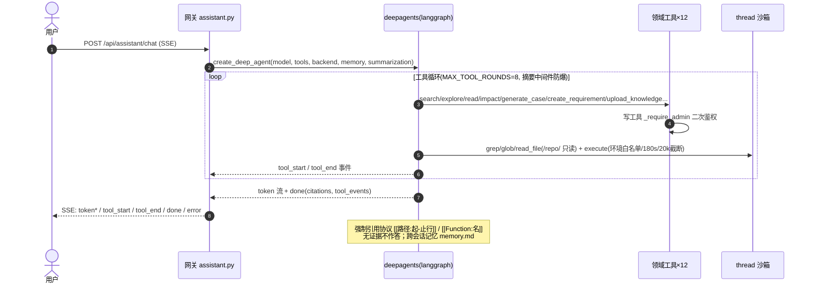
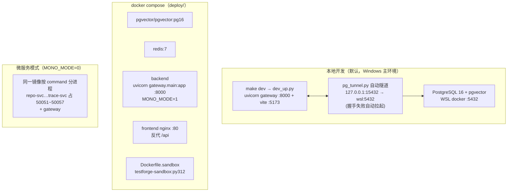

# TestForge 架构设计（As-Built · 2026-10-10）

> 配套：[PRD v4.0](./TestForge-PRD-v4.0.md) · [数据库设计](./TestForge-数据库设计.md) · [接口设计](./TestForge-接口设计.md)。
> 本文与当前仓库代码一致（含未提交的知识层演进：LightRAG 全量移植 + 知识资产两入口闭环）；2026-10-10 复核：前端信息架构收敛（Hub 化）已同步 §9，后端无变化。

---

## 1. 架构总览

**Contract-first 单体优先**：`backend/proto/testforge.proto` 是服务边界的唯一事实源（9 个业务 Servicer）；`MONO_MODE=1`（默认）时全部进程内直调、仅暴露网关一个端口，`MONO_MODE=0` 时同一套代码切换为 gRPC 网络调用（50051~50057）——切拓扑不改业务代码。

## 2. 技术选型

| 层 | 选型 | 理由 |
|---|---|---|
| 后端框架 | FastAPI + uvicorn，Python ≥3.12 | SSE/流式一等支持，pydantic 校验 |
| 服务契约 | gRPC + protobuf（testforge.v1） | 服务边界即契约，mono 模式复用同一 stub 接口 |
| ORM/存储 | SQLAlchemy 2 + PostgreSQL 16 + pgvector | 向量 + tsvector 双索引混合检索 |
| LLM | langchain-deepseek（OpenAI 兼容协议） | `LLM_BASE_URL` 一处配置即可切换内部网关/vLLM |
| 智能体 | deepagents 0.7（langgraph 流式） | 领域工具 + 内置文件/执行工具 + 记忆 + 摘要中间件 |
| 代码分析 | tree-sitter-language-pack + networkx | 15 语言函数卡片；Louvain 聚类/SCC |
| 前端 | React 18 + Vite + TS + AntD 5 + React Query + zustand | 企业中后台成熟栈；Sigma.js 渲染文档图谱 |
| 任务队列 | jobs 表 + 进程内 worker（`FOR UPDATE SKIP LOCKED`） | 零新增组件，持久化 + 崩溃重排队 |
| 沙箱 | local 子进程 / docker `testforge-sandbox:py312` | `--network none` 网络隔离 |

## 3. 服务拆分与 gRPC 契约

9 个 Servicer、7 个 gRPC 端口（DefectSvc / PlanSvc 与 TraceLog 同进程托管于 trace-svc）：

| 端口 | 服务 | RPC | 职责 |
|---|---|---|---|
| 50051 | RepoSvc | Ping / Register / RegisterUpload / Pull / ListFunctions(stream) | 仓库接入、zip 建仓、增量拉取、函数索引流 |
| 50052 | WikiBuilder | Ping / Rebuild / GetModulePage | Wiki 分层编译、增量重建（stale 传播、rev 递增） |
| 50053 | ContractRegistry | Ping / Register / Impact(stream) | 契约版本化、breaking 影响流式分析 |
| 50054 | ReqIngest | Ping / Parse | 需求四步解析（story/rules/conflict/testability） |
| 50055 | TestGen | Ping / Generate(stream) / RegenerateAffected | 五步生成流（plan/guard/probe/codegen/sandbox/coverage） |
| 50056 | TestRunner | Ping / Execute | 沙箱执行（RunReport: pass/coverage/repair_rounds/cost_s） |
| 50057 | TraceLog / DefectSvc / PlanSvc | Ping / Append / Query(stream)；CreateFromRun / TriggerRegression；EvaluateExitPlan | 追溯事件、缺陷闭环、迭代准入准出 |

调用机制（`grpc_client.py`）：`grpc_call()/grpc_stream()` 统一入口——mono 模式走 `mono.dispatch` 进程内直调（`FakeContext.abort()` 等价 gRPC abort）；微服务模式走 `insecure_channel` + stub 缓存 + UNAVAILABLE/DEADLINE 重试；trace_id 经 `x-trace-id` metadata 全链透传。

## 4. 核心流程

### 4.1 用例生成管线（两阶段 + 探针校正）

**关键设计**：期望值不来自 LLM——探针对仓库检出的真实代码实际执行捕获（固定时钟 `time.time=1700000000` 保证时间/HMAC 断言可重放；双跑不一致判非确定性，诚实剔除）。阶段 B 是「输入设计 → 可执行测试」的确定性渲染，同一清单重复渲染结果一致。

### 4.2 变更驱动回归闭环

### 4.3 缺陷闭环

### 4.4 知识文档摄入管线（状态机）

管线分工：抽取产出暂存 `kg_extractions`（每文档留存，是删除重建的数据源）→ 合并进 `kg_entities/kg_relations`（向量入检索库 kind=kg_entity/kg_relation）→ 社区报告入 kind=kg_community。LLM Key 未配置时状态机照常走完、抽取步显式 failed（无 mock 原则）。

### 4.5 KG 六模式查询

### 4.6 AI 助手工具循环

## 5. 知识体系：双索引设计

平台维护两套互补的检索底座，统一落在 `rag_documents` 一张物理表（kind 区分）：

| | 业务混合检索 | 文档知识图谱（KG） |
|---|---|---|
| 粒度 | 文档/用例/Wiki 页整条 | chunk → 实体/关系 → 社区 三层 |
| kind | wiki/user_doc/lesson/plan/req/case/defect/function/contract | kg_chunk / kg_entity / kg_relation / kg_community |
| 召回 | pgvector 向量 + tsvector 全文 → RRF(k=60) 融合 → 可选 rerank | 双层关键词分头召回 + token 预算 + focus 子图 |
| 消费方 | 上下文组装(similar/bugs)、检索测试台、AI 助手 search | KG 六模式查询、AI 助手 explore、Ollama 兼容层 |
| 更新 | 写路径同步索引（copy-and-swap 原子批量） | 异步管线状态机（pending→ok/failed） |

**workspace 隔离**：KG 侧 `workspace` 列区分 `repo:{id}` / `default` / legacy 空串（老数据零破坏）；kind 不映射 workspace——保住跨 kind 连边与社区完整性（LightRAG 设计取舍）。

## 6. LLM 调用设计

- **通道**：`llm.py` 统一 ChatDeepSeek（OpenAI 兼容），四角色路由：`extract`（批量抽取/摘要）/ `query`（最终生成/报告，可配 reasoner 级）/ `keyword`（检索词，轻量）/ `vlm`（docx 图片描述，独立网关）。
- **缓存**：`(role, model, system, prompt)` 内容 hash 键控落 `llm_cache` 表——增量重建/重复查询零 token 成本；embedding 另有 `embedding_cache` 持久缓存。
- **无 mock 原则**：Key 未配置或输出非法一律显式报错（LLMError / 管线 failed），不存在确定性假实现。
- **调用环节全景**：用例规划（智能体）、KG 抽取+gleaning、合并摘要（≥8 源）、社区报告、六模式问答、Wiki 问答、知识评估门卫（keyword）、知识洞察、缺陷修复建议、AI 助手。
- **不调 LLM 的环节**（确定性实现）：需求解析（正则）、Wiki 页渲染、契约 breaking 判定、覆盖守卫、探针、准出核对、回归判定、codegen 渲染。

## 7. 安全设计

| 面 | 机制 |
|---|---|
| 认证 | PBKDF2-SHA256 10 万轮 + 盐；无状态 HMAC token（`user:expiry:role:sig`，12h TTL，<6h 自动续签 `X-Renewed-Token`）；SSE 走 query 参数兜底 |
| 授权 | admin/viewer 两级；viewer 非 GET 一律 403；写操作处理器内 `_require_admin` 二次校验（防御纵深）；must_change 用户仅可改密/聊天 |
| 爆破防护 | 登录限速：同 IP 60s×5 / 同账号 15min×10，锁约 5 分钟；停用/删除 60s 缓存内即时拒绝 |
| 生产拒启 | ENV=prod 五项强制校验（默认密钥/缺 LLM key/沙箱未容器化/允许本地仓/Ollama 未设密钥） |
| 输入门卫 | 敏感信息 11 条正则双端拦截（写入 422 / 查询打码）；知识评估分 <0.5 拒绝；qa 类无来源拒绝 |
| 上传防护 | zip-slip / 绝对路径 / `..` / 反斜杠防护；200MB/2 万成员/1GB 总量上限；排除目录剪枝；slug 消毒 |
| 执行隔离 | runner 沙箱 docker `--network none`/512m/1cpu（或 local 子进程）；AI execute 沙箱环境白名单（.env 密钥不透传）+ thread 工作区 + 超时 + 输出截断；`/repo/` 只读挂载 |
| 对外面 | MCP 只读 13 工具（写不走旁路）；Ollama 层模块内自校验（prod 必须配 key）；webhook 可选共享密钥；日志/trace 入库前 sanitize 脱敏 |

## 8. 部署架构

常用运维面（Makefile）：`make proto / dev / test / lint / demo-m0~m5 / seed-real / mcp / kg-rebuild-vdb / kg-clean-cache / kg-repair / kg-communities / rag-eval / stack-up`。

## 9. 前端架构

- **组织**：`src/views/` 20 视图，**Hub 收敛式信息架构**——同域功能收拢为一页多 Tab，砍掉重复菜单入口：知识资产页（资产库 + 图谱管线双 Tab）、知识图谱 Hub（代码图谱 + 文档图谱双 Tab）、检索中心（查询实验 + 检索测试台 + 检索质量三 Tab）；共享展示组件以 `embedded` prop 复用（Hub 内嵌或独立页均可挂）。`?view=` URL 路由；App.tsx Shell 统一监听 `tf-navigate` CustomEvent 实现引用标签跨页直达。
- **懒渲染**：antd Tabs 首次激活才挂载子视图——Sigma 等重初始化成本延后，激活后保持挂载不重复初始化。
- **数据层**：api.ts 统一封套解包 + AuthError + token localStorage + `X-Renewed-Token` 无感续签；React Query 管理服务端状态；zustand 管全局信号（待审数/跨视图刷新）。
- **流式**：EventSource（GET SSE，token 走 query）+ `postStreamSSE`（POST SSE：KG 流式问答 retrieved→delta*→done）+ AI 助手 chat SSE 五事件。
- **可视化**：Sigma.js + graphology（代码图谱/文档图谱：类型图例/社区着色/focus 展开/实体编辑）、ECharts（业务关系图/统计图）、Mermaid（AI 助手流程图）。
- **体验**：i18n 中英双语（`useLang` 订阅语言切换，antd ConfigProvider locale 同步联动 zh_CN/en_US）、亮暗主题（html[data-theme]）、NextStep 操作引导。

## 10. 可观测性

| 手段 | 落点 |
|---|---|
| 全链路追溯 | traceID（非 GET 自动生成 + 响应头 `X-Trace-Id` + gRPC metadata 透传）→ trace_events 八类事件 |
| 生成过程 | generation_events 五阶段事件流，SSE 断线回放 |
| 文档管线 | doc_status 状态机台账（kind×status 聚合视图 + 失败原因） |
| 任务台账 | jobs 表（queued/running/done/failed + error） |
| 结构化日志 | logutil JSON 日志 + contextvars trace_id |
| 检索质量 | rag_eval 黄金集 recall@k / MRR（混合 vs 向量单路对照） |
| 摄入健康 | /api/knowledge/status + /api/system/services 链路探测 |
